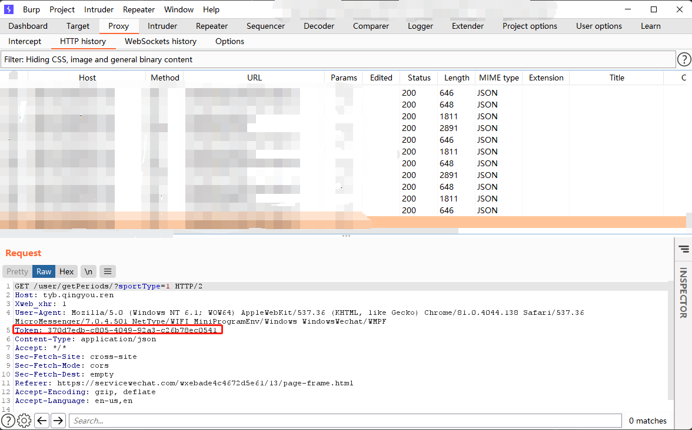

# bookCourt
## Wechat packet capture:
1. Setup [`Proxifier`](https://www.proxifier.com/)
  
  - Profiles - Proxy Servers -Add:
    
    - Address: *$address*
      
    - Port: *$port*
      
    - Protocol: HTTPS
      
  - Proxification Rules - Add:
    
    - Name: *$custom*
      
    - Applications: every *WeChatApp.exe*、every *WeChatAppEx.exe*
      
    - Action: Proxy HTTPS 127.0.0.1
      
  - Enable *$custom* and set *Localhost* as Direct
    
2. Setup [`Burp Suite`](https://portswigger.net/burp)
  
  - Proxy - Options -Proxy Listenners:
    
    - Bind to port: *$port*
      
    - Bind to adderss: *Loopback only*
      
3. Open mini program
4. Burp Suite - Proxy - Intercept - Intercept is on

## How to use:
1.Fill your own token in *basicConfig.py*:
````python
mytoken = "13673187-6798-435e-8e32-06fb6cac3a50"
````
- Notice: the token expired <u>every 24 hours</u>.

2.Fill your booking info in *basicConfig.py*:
````python
myBookInfo = [periodIdList["Badminton 16to17"], stadiumIdList["Badminton court4"]]
````
- Notice: you can find other keys in variable *stadiumIdList* and *periodIdList*

3.Change values *token_han* and bookInfo in *main.py* to two above values:
````python
    f = func(mytoken)  # put your token here
    f.getPriLogs()
    f.bookCourt(myBookInfo)  # put your book info here
````

## tips:
path of *WeChatApp.exe*:
````shell
C:\Users\$USERNAME\AppData\Roaming\Tencent\WeChat\XPlugin\Plugins\XWeb\$RANDOM_NUMBER\extracted\wechatapp.exe
````
- Note: find all WeChatApp.exe in every `$RANDOM_NUMBER` folder.

path of *WeChatAppEx.exe*:
````shell
C:\Users\$USERNAME\AppData\Roaming\Tencent\WeChat\XPlugin\Plugins\WMPFRuntime\$RANDOM_NUMBER\extracted\runtime\WeChatAppEx.exe
````
- Note: find all WeChatApp.exe in every `$RANDOM_NUMBER` folder.

token is here:

